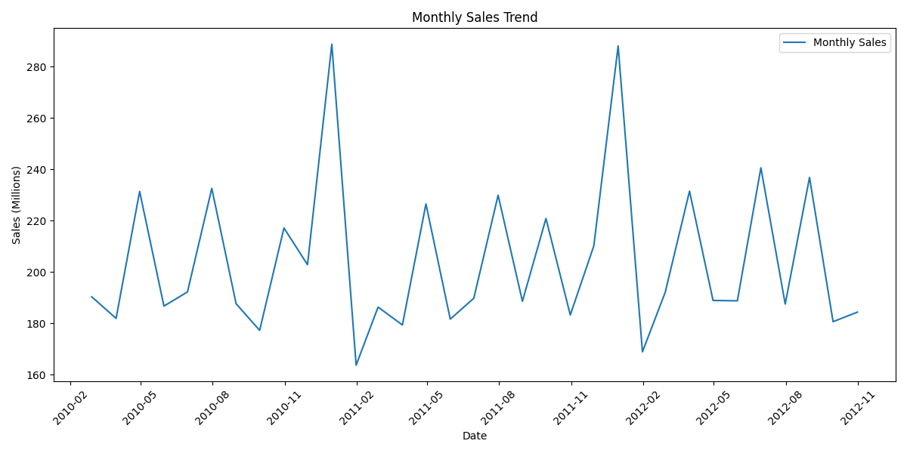

# Task 7: Time Series Breakdown of Retail Sales

This project is part of my **Elevvo Internship (Data Analytics track)**.  
The objective was to analyze Walmart’s retail sales dataset to uncover trends, seasonal patterns, and revenue breakdowns.

## 📂 Dataset
- Source: [Walmart Sales Forecasting (Kaggle)](https://www.kaggle.com/datasets/aslanahmedov/walmart-sales-forecast/data?select=features.csv)
- Data includes weekly sales, store IDs, department IDs, and dates.

## 🛠️ Tools & Libraries
- Python
- Pandas
- Matplotlib
- Seaborn
- Jupyter Notebook

## 🔎 Key Steps
1. **Data Loading** – Read `train.csv` into Pandas DataFrame  
2. **Data Cleaning & Preparation** – Inspect data types and missing values  
3. **Summary Statistics** – Describe weekly sales and other numeric features  
4. **Time Series Analysis** – Resample weekly sales into monthly totals  
5. **Visualizations** – Plot trends, moving averages, and seasonal patterns  
6. **Revenue Breakdown** – Analyze total sales by store and department  
7. **Conclusions** – Summarize insights from the analysis  

## 📊 Key Insights
- **Monthly Sales:** Clear seasonal patterns with peaks around major holidays.  
- **Trends:** Rolling averages reveal smooth trends and short-term fluctuations.  
- **Top Stores & Departments:** Revenue is concentrated in certain stores and departments.  
- **Forecasting:** Short-term Holt-Winters forecast provides projections for planning.  
- **Overall:** Understanding trends and seasonality can optimize inventory and marketing strategies.

## 📈 Visualizations

### Monthly Sales Trend

### Monthly Sales with 3-Month Rolling Average

### Top 10 Stores by Total Sales

### Top 10 Departments by Total Sales

## ▶️ How to Run
- Install dependencies: `pip install -r requirements.txt`  
- Open the notebook: `jupyter notebook Retail_Sales_Analysis.ipynb`
